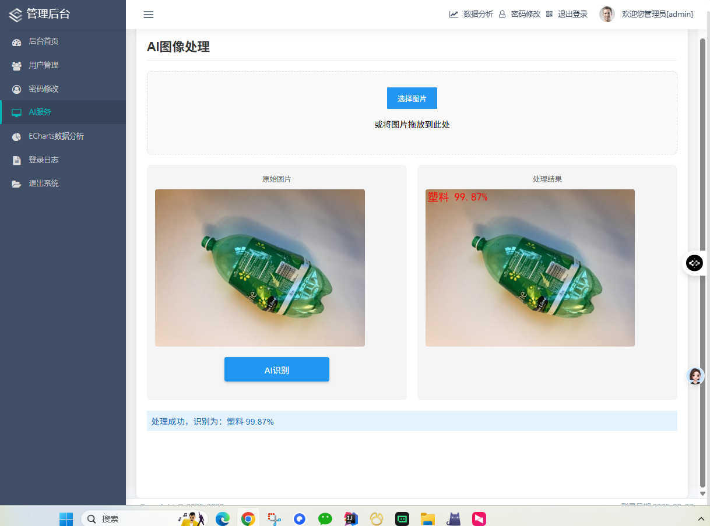
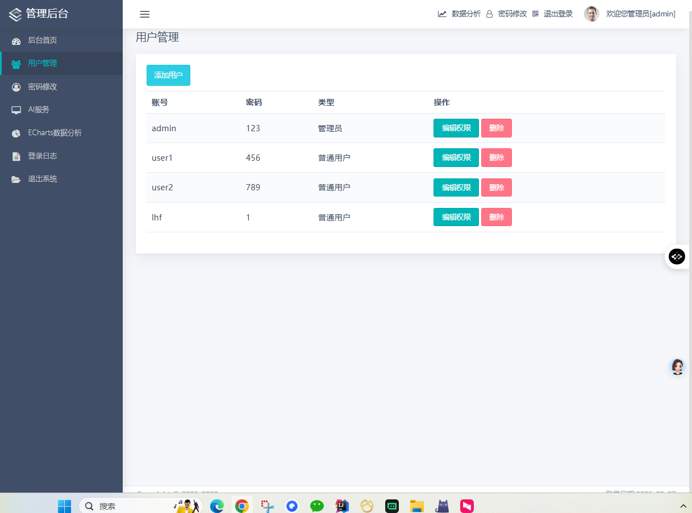
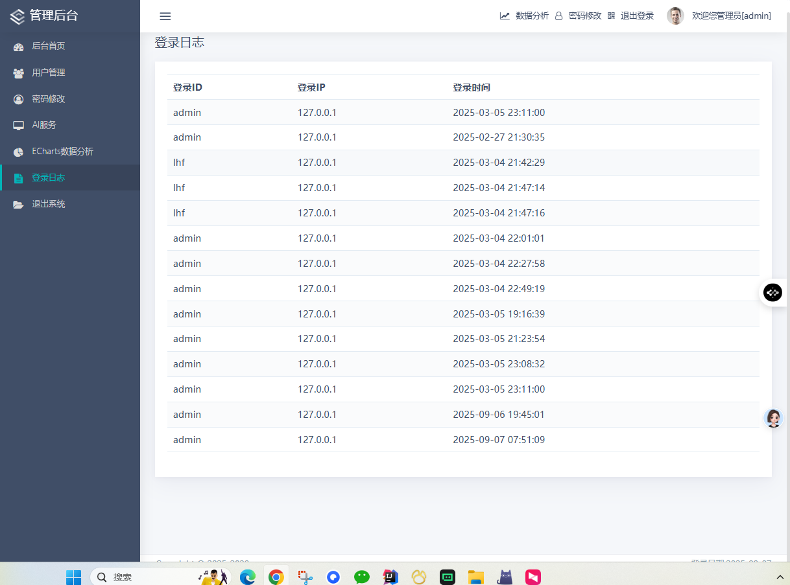

# Rubblish-master 智能垃圾分类系统
# 源码获取：https://mbd.pub/o/bread/YZWXlZ1yZg==
# 源码获取：咨询定制加微jsjbyzd
## 项目概述

Rubblish-master 是一个基于深度学习的智能垃圾分类系统，采用Flask框架构建Web应用，集成ResNet50模型实现6类垃圾的自动识别分类。系统提供完整的用户管理、图像识别、数据可视化功能。

## 🚀 核心功能

### 🔐 用户管理系统

- 多角色权限管理（管理员/普通用户）
- 用户注册、登录、密码修改
- 登录日志记录和安全审计

### 🤖 AI图像识别系统

- **6类垃圾识别**: 纸板、玻璃、金属、纸类、塑料、其他干垃圾
- **实时图像处理**: 支持上传图片自动分类
- **置信度显示**: 百分比形式展示识别准确率
- **中文优化**: 完整的中文界面和标签支持

### 📊 数据可视化

- ECharts动态图表分析
- 训练性能指标可视化
- 用户行为统计分析
- 实时数据监控

## 🛠️ 技术架构

### 后端技术栈

- **Web框架**: Flask 1.1.4
- **数据库**: MySQL + PyMySQL 0.10.1
- **深度学习**: PyTorch 1.8.1 + ResNet50
- **图像处理**: OpenCV 4.5.4 + Pillow 8.4.0
- **数据处理**: NumPy 1.21.6

### 前端技术栈

- **UI框架**: Bootstrap + 自定义CSS
- **交互框架**: Vue.js + jQuery
- **图表库**: ECharts
- **响应式设计**: 支持PC和移动端

## 📁 项目结构

```
Rubblish-master/
├── main.py                 # Flask主应用入口
├── config.py               # 数据库配置文件
├── ai_model.py            # AI模型推理模块
├── train_resnet.py        # 模型训练脚本
├── predict_resnet.py      # 模型预测脚本
├── model_resnet.py        # ResNet模型定义
├── requirements.txt       # Python依赖包列表
├── flaskt.sql            # 数据库初始化脚本
├── models/               # 模型文件目录
│   ├── resnet-pre.pth    # 预训练权重
│   └── resnet.pth        # 训练好的模型
├── data_set/            # 训练数据集
│   └── sn_data/
│       ├── train/       # 训练集（6分类）
│       └── val/         # 验证集（6分类）
├── static/              # 静态资源目录
│   ├── ai_model/        # AI模型相关文件
│   ├── uploads/         # 文件上传目录
│   └── mb/              # 移动端资源
├── templates/           # HTML模板文件
│   ├── new_*.html       # 新版界面模板
│   └── base/           # 基础模板
├── logs/               # 日志文件目录
│   ├── resnet.txt      # 训练日志
│   └── performance.txt # 性能日志
└── utils/              # 工具函数库
```

## 🗄️ 数据库设计

### 主要数据表结构

#### users 用户表

| 字段名   | 类型        | 描述     |
| -------- | ----------- | -------- |
| username | varchar(50) | 用户名   |
| password | varchar(50) | 密码     |
| usertype | varchar(50) | 用户类型 |

#### login_logs 登录日志表

| 字段名     | 类型    | 描述     |
| ---------- | ------- | -------- |
| id         | int(11) | 主键ID   |
| username   | text    | 用户名   |
| ip_address | text    | IP地址   |
| login_time | text    | 登录时间 |

#### ai_photo AI识别记录表

| 字段名     | 类型         | 描述     |
| ---------- | ------------ | -------- |
| userid     | varchar(255) | 用户ID   |
| username   | varchar(255) | 用户名   |
| fileanme   | varchar(255) | 文件名   |
| result     | varchar(255) | 识别结果 |
| con_level  | float(10,0)  | 置信度   |
| login_time | datetime     | 识别时间 |

## 📸 系统截图

### 登录界面


### 管理后台


### AI识别功能


### 数据分析

